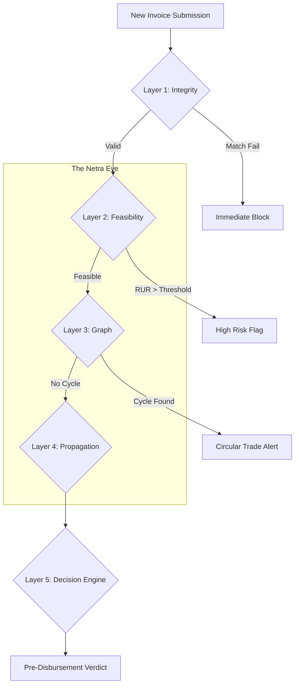

# 👁️ Netra (नेत्र) 
### *Nothing Escapes the Eye: Pre-Disbursement Fraud Intelligence for Multi-Tier SCF*

**Netra** is a high-fidelity fraud intelligence platform designed for banks and financial institutions. It moves beyond traditional document validation by analyzing the **economic integrity** of a supply chain—detecting systemic fraud, circular trading, and cascading risks *before* capital is disbursed.

---

## 📽️ The Core Vision
In Multi-Tier Supply Chain Finance (SCF), a single "Phantom Invoice" at Tier 1 can multiply into millions of dollars of fraudulent exposure across Tier 2 and Tier 3. **Netra** acts as a systemic firewall, ensuring that every dollar financed represents genuine economic activity.

---

## 🧠 The 5-Layer Intelligence Framework

Netra processes every financing request through a multi-dimensional 5-layer framework to generate a definitive risk verdict.

### 1. 🛡️ Integrity Layer (Invoice Authenticity)
*   **3-Way Reconciliation:** Automated cross-matching of **Purchase Orders (PO)**, **Invoices**, and **Goods Receipt Notes (GRN)**.
*   **Privacy-Preserving Fingerprinting:** Generates unique SHA-256 hashes of invoice metadata. This creates a "Shared Registry" that detects **Double Financing** across multiple banks without compromising sensitive client data.

### 2. 📊 Capacity Layer (Economic Feasibility)
*   **Revenue Utilization Ratio (RUR):** Our signature metric. It correlates financed invoice volume against the supplier's declared annual revenue.
    *   *Logic:* If a company earns ₹10Cr/year but attempts to finance ₹60Cr in invoices, Netra flags **Phantom Scaling**.
*   **Tier-Alignment Modeling:** Cross-references upstream supply capacity with downstream output to detect production mismatches.

### 3. 🕸️ Graph Layer (Network Integrity)
*   **Carousel Trade Detection:** Uses **Cycle Detection Algorithms** (NetworkX) to identify circular trading (A → B → C → A) designed to artificially inflate turnover.
*   **Centrality Anomaly Detection:** Flags "Bridge Nodes"—small entities with unusually high centrality that often signal shell company behavior.

### 4. 🌊 Propagation Layer (Exposure Stability)
*   **Risk Contagion Modeling:** Quantifies how the failure or fraud of a Tier 1 supplier **impacts the downstream exposure** of Tier 2 and Tier 3 partners.
*   **Stress Simulation:** Simulates the systemic impact if a specific high-risk node is removed from the network, providing banks with a "What-If" exposure analysis.

### 5. ⚖️ Decision Layer (Explainable AI)
*   **Composite Risk Scoring:** A weighted aggregation of all layers (Integrity, Capacity, Network, Propagation).
*   **Human-Readable Justification:** Provides the "Why" behind every decision. 
    *   *Example Verdict:* `BLOCK: RUR exceeds 4.0; Circular trade detected in Tier 2; Risk Contagion > 75%`.

---

## 🛠️ Technical Architecture

### Stack & Tools
*   **Backend:** Python (FastAPI) for high-performance risk evaluation.
*   **Graph Engine:** `NetworkX` for complex relationship mapping and cycle detection.
*   **Analytics:** `Pandas` & `NumPy` for RUR calculation and statistical anomaly detection.
*   **Security:** `Hashlib` (SHA-256) for privacy-preserving data sharing.

---

## 📈 Why It Wins
1.  **Stops the "Cascade":** Unlike ERP systems, Netra understands that fraud in Tier 1 amplifies risk in Tier 3.
2.  **Regulatory Ready:** Full explainability makes it audit-compliant for banking standards.
3.  **Proactive, Not Reactive:** It is a **Pre-Disbursement** engine. It stops the loss *before* the bank hits 'Send'.

---

## 🚀 Future Roadmap
*   **Zero-Knowledge Proofs (ZKP):** To allow banks to verify invoices across competitors without revealing ANY data.
*   **Sector-Specific Benchmarking:** Dynamic RUR thresholds for Retail vs. Manufacturing.
*   **Real-time ERP Hooks:** Direct API integration with SAP, Oracle, and Tally for live verification.

---

## 🚀 Future Roadmap
*   **Zero-Knowledge Proofs (ZKP):** Truly private inter-bank invoice verification.
*   **AI-Driven Thresholds:** Dynamic RUR limits based on real-time industry benchmarks.
*   **ERP Direct Hookups:** Real-time data feeds from Tally, SAP, and Oracle.

---
*Developed for the Multi-Tier Supply Chain Fraud Challenge.*
