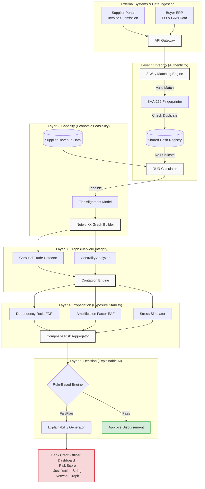

# 🏗️ Netra: System Architecture

This diagram illustrates the flow of data through the Netra Pre-Disbursement Fraud Intelligence Engine.

```mermaid
graph TD
    %% External Data Sources
    subgraph "External Systems & Data Ingestion"
        A1[Supplier Portal<br>Invoice Submission] --> INGEST[API Gateway]
        A2[Buyer ERP<br>PO & GRN Data] --> INGEST
    end

    INGEST --> L1

    %% Layer 1: Integrity
    subgraph "Layer 1: Integrity (Authenticity)"
        L1[3-Way Matching Engine]
        L1_Hash[SHA-256 Fingerprinter]
        L1_Reg[(Shared Hash Registry)]
        
        L1 -->|Valid Match| L1_Hash
        L1_Hash -->|Check Duplicate| L1_Reg
        L1_Reg -->|No Duplicate| L2
    end

    %% Layer 2: Capacity
    subgraph "Layer 2: Capacity (Economic Feasibility)"
        L2[RUR Calculator]
        L2_Data[(Supplier Revenue Data)]
        L2_Align[Tier-Alignment Model]
        
        L2_Data --> L2
        L2 -->|Feasible| L2_Align
        L2_Align --> L3
    end

    %% Layer 3: Graph
    subgraph "Layer 3: Graph (Network Integrity)"
        L3[NetworkX Graph Builder]
        L3_Cycle[Carousel Trade Detector]
        L3_Cent[Centrality Analyzer]
        
        L3 --> L3_Cycle
        L3 --> L3_Cent
        L3_Cycle --> L4
        L3_Cent --> L4
    end

    %% Layer 4: Propagation
    subgraph "Layer 4: Propagation (Exposure Stability)"
        L4[Contagion Engine]
        L4_FDR[Dependency Ratio FDR]
        L4_EAF[Amplification Factor EAF]
        L4_Stress[Stress Simulator]
        
        L4 --> L4_FDR
        L4 --> L4_EAF
        L4 --> L4_Stress
        L4_FDR --> L5
        L4_EAF --> L5
        L4_Stress --> L5
    end

    %% Layer 5: Decision
    subgraph "Layer 5: Decision (Explainable AI)"
        L5[Composite Risk Aggregator]
        L5_Rules{Rule-Based Engine}
        L5_Expl[Explainability Generator]
        
        L5 --> L5_Rules
        L5_Rules -->|Pass| APPROVE[Approve Disbursement]
        L5_Rules -->|Fail/Flag| L5_Expl
    end

    %% Outputs
    L5_Expl --> DASHBOARD[Bank Credit Officer Dashboard<br>- Risk Score<br>- Justification String<br>- Network Graph]

    %% Styling
    classDef layer fill:#f9f9f9,stroke:#333,stroke-width:2px;
    classDef decision fill:#d4edda,stroke:#28a745,stroke-width:2px;
    classDef alert fill:#f8d7da,stroke:#dc3545,stroke-width:2px;
    
    class INGEST,L1,L2,L3,L4,L5 layer;
    class APPROVE decision;
    class DASHBOARD alert;
```
